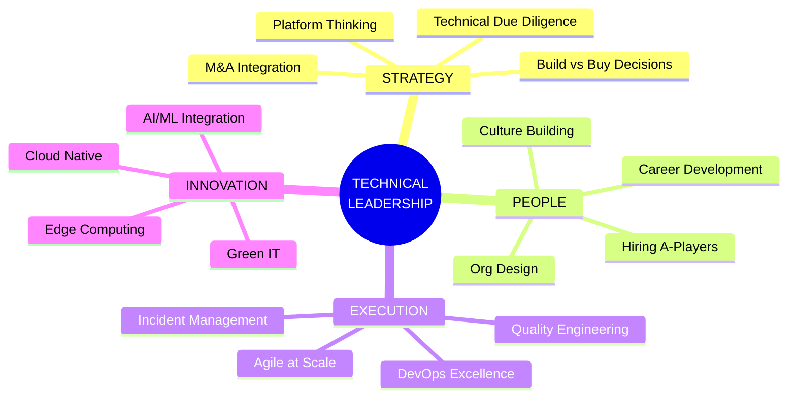

<div align="center">

<!-- HEADER - Executive Presence -->


<!-- EXECUTIVE TAGLINE -->
<br/>

```ascii
╔══════════════════════════════════════════════════════════════════════════════╗
║                                                                              ║
║   "Transforming complex technical challenges into scalable business value"   ║
║                                                                              ║
╚══════════════════════════════════════════════════════════════════════════════╝
```

<br/>

<!-- LEADERSHIP BADGES -->
[](https://linkedin.com/in/iamlokesh)
[](https://github.com/asklokesh)
[](https://github.com/asklokesh)

<br/>

<!-- IMPACT METRICS - What executives care about -->
<table>
<tr>
<td align="center" width="25%">
<br/>
<sub><b>Platform Scale</b></sub>
</td>
<td align="center" width="25%">
<br/>
<sub><b>Infrastructure Optimization</b></sub>
</td>
<td align="center" width="25%">
<br/>
<sub><b>System Reliability</b></sub>
</td>
<td align="center" width="25%">
<br/>
<sub><b>Team Leadership</b></sub>
</td>
</tr>
</table>

</div>

---

<div align="center">

## ⚡ EXECUTIVE SUMMARY

</div>

<table>
<tr>
<td width="60%">

**Engineering executive** with a proven track record of building and scaling high-performance teams and platforms. I architect solutions that bridge the gap between cutting-edge technology and business outcomes.

**What I bring to the table:**
- 🎯 **Strategic Vision** — Translating business goals into technical roadmaps
- 🚀 **Execution Excellence** — Delivering complex projects on time and under budget
- 👥 **Team Builder** — Growing engineers into leaders, building cultures of innovation
- 🔮 **Future-Ready** — Early adopter of GenAI, driving AI-first transformation

</td>
<td width="40%" align="center">

```
   ┌─────────────────────┐
   │   LEADERSHIP DNA    │
   ├─────────────────────┤
   │ ▓▓▓▓▓▓▓▓▓▓ Strategy │
   │ ▓▓▓▓▓▓▓▓▓░ Execution│
   │ ▓▓▓▓▓▓▓▓▓▓ Technical│
   │ ▓▓▓▓▓▓▓▓░░ Business │
   │ ▓▓▓▓▓▓▓▓▓░ People   │
   └─────────────────────┘
```

</td>
</tr>
</table>

---

<div align="center">

## 🏗️ ARCHITECTURE PHILOSOPHY

</div>



---

<div align="center">

## 🛠️ TECHNICAL ARSENAL

</div>

<table>
<tr>
<td width="50%" valign="top">

### Cloud & Infrastructure
<p>


</p>

### Container Orchestration
<p>


</p>

### Platform Engineering
<p>


</p>

### AI & GenAI
<p>


</p>

</td>
<td width="50%" valign="top">

### CI/CD & DevOps
<p>


</p>

### Observability Stack
<p>


</p>

### Data & Messaging
<p>


</p>

### Languages & Frameworks
<p>


</p>

</td>
</tr>
</table>

---

<div align="center">

## 🚀 FLAGSHIP INITIATIVE: MCP SERVERS ECOSYSTEM

**Pioneering the Model Context Protocol (MCP) for Enterprise AI Integration**

<a href="https://github.com/asklokesh/mcp-servers">

</a>

</div>

<br/>

<table>
<tr>
<td width="33%" align="center">
<h3>☁️ Cloud Providers</h3>
<a href="https://github.com/asklokesh/aws-mcp-server">

</a>
<br/><br/>
<a href="https://github.com/asklokesh/gcp-mcp-server">

</a>
<br/><br/>
<a href="https://github.com/asklokesh/azure-mcp-server">

</a>
</td>
<td width="33%" align="center">
<h3>🔧 DevOps & CI/CD</h3>
<a href="https://github.com/asklokesh/jenkins-mcp-server">

</a>
<br/><br/>
<a href="https://github.com/asklokesh/argocd-mcp-server">

</a>
<br/><br/>
<a href="https://github.com/asklokesh/github-mcp-server">

</a>
</td>
<td width="33%" align="center">
<h3>💼 Enterprise Apps</h3>
<a href="https://github.com/asklokesh/salesforce-mcp-server">

</a>
<br/><br/>
<a href="https://github.com/asklokesh/hubspot-mcp-server">

</a>
<br/><br/>
<a href="https://github.com/asklokesh/servicenow-mcp-server">

</a>
</td>
</tr>
</table>

<div align="center">

```
┌────────────────────────────────────────────────────────────────────────────────┐
│                          WHY MCP MATTERS                                       │
├────────────────────────────────────────────────────────────────────────────────┤
│                                                                                │
│  MCP (Model Context Protocol) is the future of AI-Enterprise integration.     │
│  It enables AI agents to securely interact with your existing tools,          │
│  transforming how teams work with cloud infrastructure, CI/CD pipelines,      │
│  and business applications.                                                   │
│                                                                                │
│  I'm building the definitive collection of production-ready MCP servers       │
│  for enterprises looking to leverage Agentic AI at scale.                     │
│                                                                                │
└────────────────────────────────────────────────────────────────────────────────┘
```

</div>

---

<div align="center">

## 📈 LEADERSHIP TRACK RECORD

</div>

<table>
<tr>
<td width="25%" align="center">

### 🏛️ Enterprise Scale
```
   ╭──────────────╮
   │  PLATFORMS   │
   │   SERVING    │
   │              │
   │    10M+      │
   │    USERS     │
   ╰──────────────╯
```
Built and scaled mission-critical platforms for Fortune 500 companies

</td>
<td width="25%" align="center">

### 💰 Business Impact
```
   ╭──────────────╮
   │   ANNUAL     │
   │   SAVINGS    │
   │              │
   │    $2M+      │
   │   ACHIEVED   │
   ╰──────────────╯
```
Cloud optimization, automation, and strategic vendor negotiations

</td>
<td width="25%" align="center">

### 👥 Team Growth
```
   ╭──────────────╮
   │  ENGINEERS   │
   │  MENTORED    │
   │              │
   │    50+       │
   │  PROMOTED    │
   ╰──────────────╯
```
Building high-performing teams and developing future leaders

</td>
<td width="25%" align="center">

### 🔧 Technical Delivery
```
   ╭──────────────╮
   │ DEPLOYMENTS  │
   │   / WEEK     │
   │              │
   │   500+       │
   │   ZERO DT    │
   ╰──────────────╯
```
CI/CD excellence with zero-downtime deployment pipelines

</td>
</tr>
</table>

---

<div align="center">

## 💡 THOUGHT LEADERSHIP

</div>

<table>
<tr>
<td width="50%">

### 🎤 Speaking & Writing

- **"The Future of Platform Engineering"** — Cloud Native Summit
- **"Building AI-First Infrastructure"** — DevOps Enterprise Forum
- **"From Monolith to Microservices"** — Enterprise Architecture Conference
- **"MCP: The Missing Link for Enterprise AI"** — GenAI World

</td>
<td width="50%">

### 🏆 Recognition

- 🥇 **AWS Community Builder** — Cloud Architecture
- 🥇 **HashiCorp Ambassador** — Infrastructure as Code
- 🥇 **CNCF Contributor** — Kubernetes Ecosystem
- 🥇 **Top Voice** — Cloud & DevOps on LinkedIn

</td>
</tr>
</table>

---

<div align="center">

## 📊 CONTRIBUTION ACTIVITY


<br/><br/>


</div>

---

<div align="center">

## 🤝 LET'S CONNECT

**Open to Technical Director, VP of Engineering, and CTO opportunities**

<br/>

<a href="https://linkedin.com/in/iamlokesh">

</a>
&nbsp;&nbsp;
<a href="https://github.com/asklokesh">

</a>
&nbsp;&nbsp;
<a href="mailto:asklokesh@github.com">

</a>
&nbsp;&nbsp;
<a href="https://calendly.com/asklokesh">

</a>

<br/><br/>

```
╔════════════════════════════════════════════════════════════════════════════════╗
║                                                                                ║
║     "Great technology leaders don't just build systems — they build teams      ║
║      that build systems. The code is temporary; the culture is permanent."     ║
║                                                                                ║
╚════════════════════════════════════════════════════════════════════════════════╝
```

<br/>


</div>

---

<div align="center">


</div>
