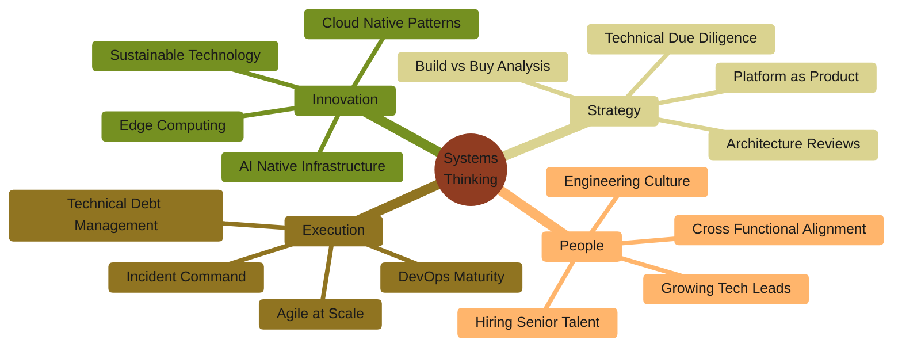

<div align="center">

<br/>

# Lokesh Mure

**Engineering Leadership  ·  Cloud Architecture  ·  AI Systems**

<br/>

<a href="https://linkedin.com/in/iamlokesh"></a>

<a href="mailto:lokeshmure@gmail.com"></a>

<br/><br/>

</div>

```
╭──────────────────────────────────────────────────────────────────────────────────╮
│                                                                                  │
│   I build platforms that scale to millions and teams that build those           │
│   platforms. My work sits at the intersection of deep technical craft           │
│   and organizational strategy.                                                   │
│                                                                                  │
│   Currently focused on Agentic AI infrastructure and the Model Context          │
│   Protocol (MCP) ecosystem for enterprise integration.                          │
│                                                                                  │
╰──────────────────────────────────────────────────────────────────────────────────╯
```

<br/>

<table>
<tr>
<td align="center" width="25%">
<br/>

<br/><br/>
<sub>Users on platforms<br/>I've architected</sub>
<br/><br/>
</td>
<td align="center" width="25%">
<br/>

<br/><br/>
<sub>Annual infrastructure<br/>cost reduction</sub>
<br/><br/>
</td>
<td align="center" width="25%">
<br/>

<br/><br/>
<sub>Uptime SLA<br/>delivered</sub>
<br/><br/>
</td>
<td align="center" width="25%">
<br/>

<br/><br/>
<sub>Engineers mentored<br/>and promoted</sub>
<br/><br/>
</td>
</tr>
</table>

<br/>

---

<br/>

<div align="center">

### How I Think About Technology

</div>

<br/>



<br/>

---

<br/>

<div align="center">

### Technical Foundation

</div>

<br/>

<table>
<tr>
<td width="50%" valign="top">

<h4>Cloud Platforms</h4>
<p>

<br/>

<br/>

</p>

<h4>Container Orchestration</h4>
<p>

<br/>

<br/>

</p>

<h4>Infrastructure as Code</h4>
<p>

<br/>

<br/>

</p>

<h4>AI and Machine Learning</h4>
<p>

<br/>

<br/>

</p>

</td>
<td width="50%" valign="top">

<h4>CI/CD and GitOps</h4>
<p>

<br/>

<br/>

</p>

<h4>Observability</h4>
<p>

<br/>

<br/>

</p>

<h4>Data Systems</h4>
<p>

<br/>

<br/>

</p>

<h4>Languages</h4>
<p>

<br/>

<br/>

</p>

</td>
</tr>
</table>

<br/>

---

<br/>

<div align="center">

### Current Focus: MCP Servers for Enterprise AI

The Model Context Protocol is how AI agents will interact with enterprise systems.
<br/>
I'm building production grade MCP servers that bridge the gap.

<br/><br/>

<a href="https://github.com/asklokesh/mcp-servers">

</a>

</div>

<br/>

<table>
<tr>
<td width="33%" align="center">
<br/>
<h4>Cloud Providers</h4>
<p>
<a href="https://github.com/asklokesh/aws-mcp-server"></a>
<br/><br/>
<a href="https://github.com/asklokesh/gcp-mcp-server"></a>
<br/><br/>
<a href="https://github.com/asklokesh/azure-mcp-server"></a>
</p>
<br/>
</td>
<td width="33%" align="center">
<br/>
<h4>DevOps Tooling</h4>
<p>
<a href="https://github.com/asklokesh/jenkins-mcp-server"></a>
<br/><br/>
<a href="https://github.com/asklokesh/argocd-mcp-server"></a>
<br/><br/>
<a href="https://github.com/asklokesh/github-mcp-server"></a>
</p>
<br/>
</td>
<td width="33%" align="center">
<br/>
<h4>Enterprise Apps</h4>
<p>
<a href="https://github.com/asklokesh/salesforce-mcp-server"></a>
<br/><br/>
<a href="https://github.com/asklokesh/hubspot-mcp-server"></a>
<br/><br/>
<a href="https://github.com/asklokesh/servicenow-mcp-server"></a>
</p>
<br/>
</td>
</tr>
</table>

<br/>

---

<br/>

<div align="center">

### Recognition

</div>

<br/>

<table>
<tr>
<td width="50%" valign="top">

```
Speaking

· "The Future of Platform Engineering"
   Cloud Native Summit

· "Building AI First Infrastructure"
   DevOps Enterprise Forum

· "From Monolith to Microservices"
   Enterprise Architecture Conference

· "MCP: The Missing Link for Enterprise AI"
   GenAI World
```

</td>
<td width="50%" valign="top">

```
Community

· AWS Community Builder
  Cloud Architecture Track

· HashiCorp Ambassador
  Infrastructure as Code

· CNCF Contributor
  Kubernetes Ecosystem

· LinkedIn Top Voice
  Cloud and DevOps
```

</td>
</tr>
</table>

<br/>

---

<br/>

<div align="center">

### Activity

<br/>


</div>

<br/>

---

<br/>

<div align="center">

```
╭──────────────────────────────────────────────────────────────────────────────────╮
│                                                                                  │
│   Great technology leaders don't just build systems.                             │
│   They build teams that build systems.                                           │
│                                                                                  │
│   The code is temporary. The culture is permanent.                               │
│                                                                                  │
╰──────────────────────────────────────────────────────────────────────────────────╯
```

<br/>

<a href="https://linkedin.com/in/iamlokesh"></a>

<br/><br/>


<br/><br/>

</div>
