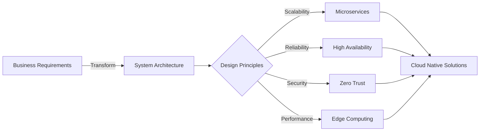

# AskLokesh | Cloud & Agentic AI Solutions Architect

---

## Tech Stack & Architecture Expertise

<table align="center">
<tr>
<td width="50%" valign="top">

### Cloud Platforms & Virtual Infrastructure

### Container & Orchestration

### CI/CD & GitOps

### Observability & Monitoring

</td>
<td width="50%" valign="top">

### Data & Messaging Platforms

### Programming & Frameworks

### Infrastructure as Code & Config Management

### API Gateways & Service Mesh

</td>
</tr>
</table>

---

## Claude Skill: Loki-Mode

**Multi-agent autonomous startup system for Claude Code - spawn parallel agents that work together on complex projects.**

---

## Featured: LokiMCPUniverse - Enterprise MCP Servers

### 25+ Production-Ready Model Context Protocol (MCP) Servers

<table>
<tr>
<td width="33%" align="center">

**Salesforce MCP**

Enterprise CRM integration

</td>
<td width="33%" align="center">

**AWS MCP**

Cloud infrastructure management

</td>
<td width="33%" align="center">

**GCP MCP**

Google Cloud Platform integration

</td>
</tr>
<tr>
<td width="33%" align="center">

**Azure MCP**

Microsoft Azure services

</td>
<td width="33%" align="center">

**Jenkins MCP**

CI/CD automation

</td>
<td width="33%" align="center">

**ArgoCD MCP**

GitOps for Kubernetes

</td>
</tr>
<tr>
<td width="33%" align="center">

**ServiceNow MCP**

ITSM automation

</td>
<td width="33%" align="center">

**HubSpot MCP**

Marketing & Sales CRM

</td>
<td width="33%" align="center">

**GitLab MCP**

DevOps platform

</td>
</tr>
<tr>
<td width="33%" align="center">

**Tableau MCP**

Data visualization

</td>
<td width="33%" align="center">

**Power BI MCP**

Business analytics

</td>
<td width="33%" align="center">

**More Servers**

[View All in Registry](https://registry.modelcontextprotocol.io/?q=asklokesh)

</td>
</tr>
</table>

---

## Architecture Philosophy

### Core Principles

<table>
<tr>
<td width="25%" align="center">

**Auto-scaling architectures** that grow with business needs
</td>
<td width="25%" align="center">

**Defense in depth** with multiple security layers
</td>
<td width="25%" align="center">

**Fault-tolerant systems** with automatic failover
</td>
<td width="25%" align="center">

**Optimized architectures** for minimal latency
</td>
</tr>
</table>

---

## Professional Experience

| Role | Focus Area | Key Achievements |
|------|------------|------------------|
| **System Architect** | Enterprise Architecture | Designed multi-cloud solutions serving 10M+ users |
| **Cloud Engineer** | Infrastructure Design | Reduced infrastructure costs by 40% through optimization |
| **API Specialist** | Integration Architecture | Built 30+ enterprise API integrations |
| **DevOps Lead** | CI/CD & Automation | Achieved 99.9% deployment success rate |

---

## Current Focus

| Building | Description |
|----------|-------------|
| **Enterprise MCP Servers** | GenAI Integration for enterprise platforms |
| **Claude Skills** | Agentic AI automation tools |
| **Cloud-Native Solutions** | Architecting solutions at scale |
| **Open-Source Tools** | Contributing to the community |

---

## Connect & Collaborate

---

**Open to collaboration on enterprise cloud architecture and AI integration projects**

