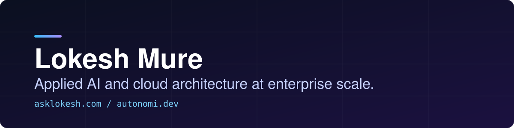

<div align="center">



[](https://asklokesh.com)
[](https://www.autonomi.dev)
[](https://github.com/asklokesh/loki-mode)

</div>

## Hi, I'm Lokesh

I lead applied AI engineering teams and enterprise-scale cloud architecture teams. The work spans modernization programs, reference architectures, distributed systems and platform engineering.

Agents are one strand of that. The one I build in public is **[Loki Mode](https://github.com/asklokesh/loki-mode)**, the engine behind **[Autonomi](https://www.autonomi.dev)**. Everything I write, ship and think about lives at **[asklokesh.com](https://asklokesh.com)**.

## What I lead and work on

- **Applied AI engineering:** getting AI and agent systems out of demos and into production.
- **Enterprise cloud architecture:** reference architectures other teams can build on.
- **Modernization:** moving large, long-lived systems forward without stopping them.
- **Distributed systems:** the part I first studied in grad school and still care about most.
- **Platform engineering:** platforms that other engineers actually want to use.

## How I got here

It started in 2008 with an old Red Hat server in a college lab. A professor let me install RHEL on a dusty machine in the corner, and I learned more in two weeks than I had in a semester. I still remember the first time I SSHed in from across the hostel and felt like a hacker in a movie. I wrote about that, and the vi struggle, on the [blog](https://asklokesh.com/blog).

After a B.Tech in Electronics and Communication, I worked as a Linux L3 engineer running datacenter operations. Then came an MS in Computer Science at Texas A&M, where I was a research assistant working on distributed systems.

From there I moved into cloud architecture at telecom scale. Since 2017 I have been working on cloud, data and AI platforms at a major entertainment company, leading architecture and engineering work at enterprise scale and building platforms that serve millions of guests. Along the way I picked up the certs people ask about (AWS Solutions Architect Professional, CKA, CKAD, RHCE, Microsoft DevOps Engineer Expert) and published two books.

The newest chapter is applied AI. I lead that work in my day job, and I build in public through Loki Mode and Autonomi. It is where everything above comes together: Linux operations, distributed systems, cloud platforms and a lot of hard lessons about what breaks in production.

## What I build in public

**[Loki Mode / Autonomi](https://www.autonomi.dev)** is an autonomous software factory. You give it a GitHub issue, a spec or a one-line task, and it plans, builds and verifies, then opens a pull request with a receipt you can re-check offline. It runs on your machine with your own keys, and works with Claude, Codex and OpenCode. The source is available under BUSL-1.1.

The part I care about most is verification. I do not want an agent that says it is done, I want one that proves it.

[](https://github.com/asklokesh/loki-mode)
[](https://github.com/asklokesh/loki-mode/forks)
[](https://github.com/asklokesh/loki-mode/releases)

```bash
npm install -g loki-mode
loki owner/repo#123     # turn a GitHub issue into a PR
```

I am also doing independent research on dependable multi-agent systems ([HARLM, a paper on adaptive recursive language models](https://asklokesh.com/papers/harlm)) and finishing MIT Professional Education work in AI and machine learning. An MBA is next.

## Selected work

| Project | What it is |
| --- | --- |
| [**loki-mode**](https://github.com/asklokesh/loki-mode) | Autonomous software factory. Issue or spec in, verified pull request out. |
| [**FireLater**](https://github.com/asklokesh/FireLater) | A ServiceNow alternative for incidents, changes and service requests. I got tired of watching teams pay six figures for software they hate using. [Why I built it](https://asklokesh.com/blog/firelater-servicenow-alternative-99-percent-cheaper). |
| [**NEXT-Portal**](https://github.com/asklokesh/NEXT-Portal) | A next-generation internal developer platform. |
| [**LokiMCPUniverse**](https://github.com/LokiMCPUniverse) | 25+ enterprise MCP servers I built in a single sprint in 2024. Now archived, because the official provider-maintained servers replaced them, which is how it should go. |
| [**sumolite**](https://github.com/asklokesh/sumolite) | Low-latency browser-based VNC alternative. WebRTC and hardware encode, macOS and Linux. |
| [**k9s-gui**](https://github.com/asklokesh/k9s-gui) | A Kubernetes GUI for people who would rather not live in a terminal. |

More on the [portfolio page](https://asklokesh.com/portfolio).

## Books and writing

I have published two books, both in 2022:

- **Mastering Cloud Engineering**, a practical guide to building and running cloud infrastructure across AWS, Azure, GCP, Kubernetes and Terraform. ([Amazon](https://www.amazon.com/Mastering-Cloud-Engineering-Strategies-Infrastructure-ebook/dp/B0BZQPFZRL))
- **From Strangers to Founders**, stories of immigrants who helped build American industry and technology.

I also keep a [blog](https://asklokesh.com/blog) with close to 200 posts, from RHCE and Docker 1.0 to re:Invent recaps, agents and what is different about leading AI teams. There is a [newsletter](https://asklokesh.com/newsletter) too, Loki's Log.

## Stack

Python, Go, TypeScript and Shell. AWS, GCP, Azure, Kubernetes, Docker, Terraform, ArgoCD and Jenkins. Lately: LLM orchestration, multi-agent systems and evaluation.

## Find me

- Website and blog: [asklokesh.com](https://asklokesh.com)
- Autonomi: [autonomi.dev](https://www.autonomi.dev)
- Loki Mode: [github.com/asklokesh/loki-mode](https://github.com/asklokesh/loki-mode)
- Book a 30 minute call: [asklokesh.com/schedule](https://asklokesh.com/schedule)
